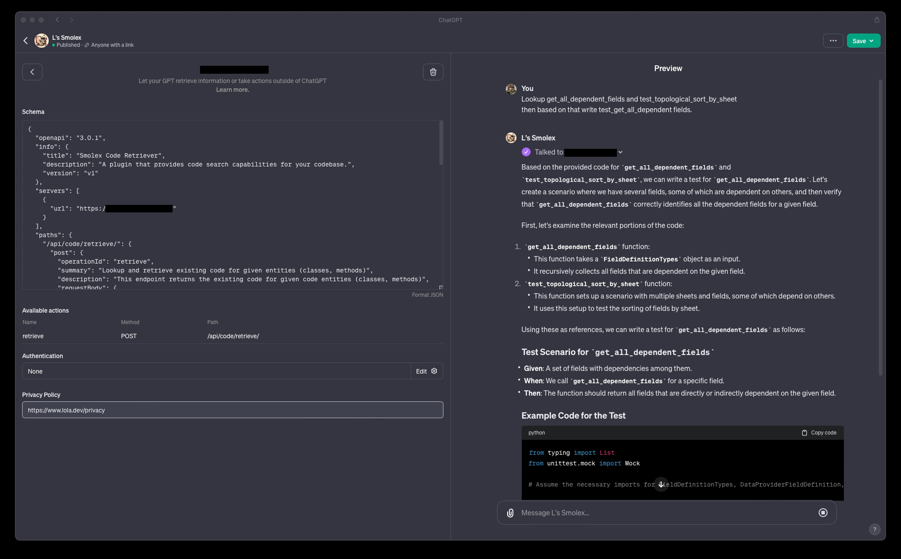

# Smolex - Code entity retrieval "GPT action" for ChatGPT!

### Motivation

The hardest part of using ChatGPT is to provide it with the right context. This is especially true when talking about
code. This is where Smolex comes in. Smolex is a [GPT](https://openai.com/blog/introducing-gpts) that can be used to
retrieve code entities from a codebase.

### Prime Use Cases

- Writing test based on existing tests.
- Updating suggested code based on existing classes / methods.
- "Look at this code, is there a way to improve it?"

#### Showcase



### How it works

We parse the codebase and create an AST for each file that we store in a SQLite database for fast lookups.
At the moment Smolex is Python only, but it should be possible to extend it to other languages. ;)

## Setup

### Install dependencies

```
pip install -r requirements.txt
```

### Run Fast API server

```
app/main.py --index-root /Users/alice/code/smolex/
```

### Setup

- Set up a new GPT.
- Add the [openapi.yml](docs/openapi.yml) as an action.
- Run server and profit.