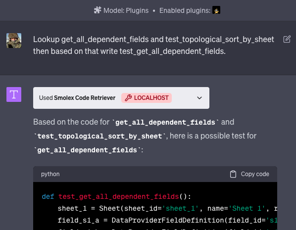
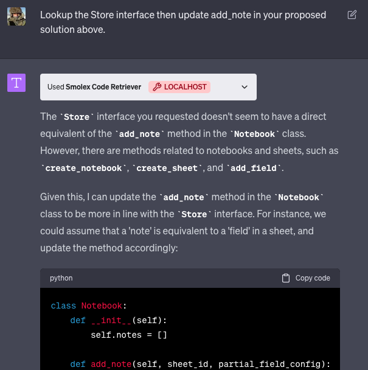

# Smolex - A code retrieval ChatGPT Plugin

**🚧 Experimental: Smolex is very experimental, mostly thrown together to serve my own needs!**

### Motivation

Sometimes I have a chat with ChatGPT about a piece of code and want to provide it with more context about my codebase.
So far I did manually craft a context to provide to ChatGPT, but this is tedious when also considering the token limit.

Smolex is an experimental plugin for ChatGPT that allows ChatGPT to lookup code context in a codebase and use that as
context for the conversation. This allows for more natural conversations about code.

### Use Cases

#### Writing test based on existing tests



#### Updating suggested code based on existing class intefaces / signatures



### How it works

We create embeddings for all code in the codebase and store them locally. We also AST parse all code and store that in a
local SQLite database. When a user asks a question, we try to look up the requested code in the database and either
return the entire code or a summary of the code ("interface" / signature). In case we have no match in the database, we
use the vector store to find the code (or interface) that might be most relevant to the question.

At the moment Smolex is Python only, but it should be possible to extend it to other languages. ;)

## Setup

### Install dependencies

```
pip install -r requirements.txt
```

### Run API server

```
# update config.py with your codebase path

export OPENAI_API_KEY=<your key>
python ./main.py
```

### Install plugin

See [Chat Plugin docs](https://platform.openai.com/docs/plugins/introduction) for details. In general:

- Plugin Store -> Develop your own plugin -> localhost:5003

### Re-index codebase (as needed)

Rebuilts the AST and Vectorstore. Manually triggered, as needed (e.g. after code changes).

```
python ./reindex.py
```
